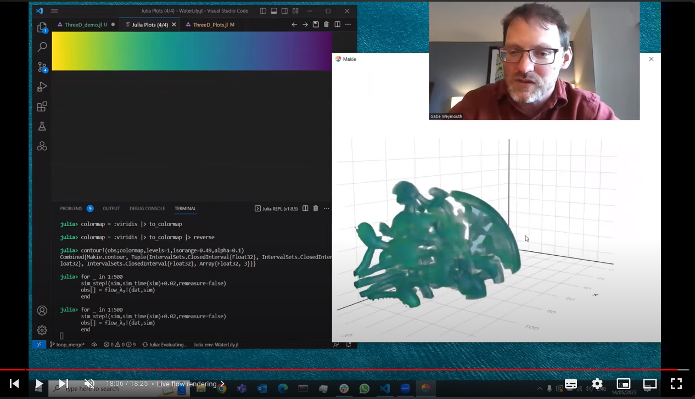
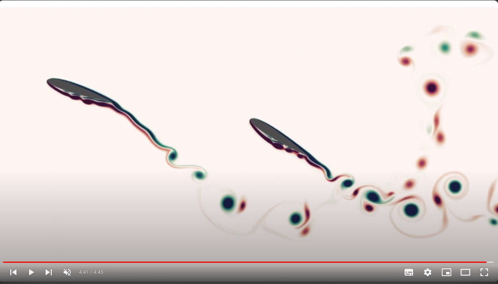
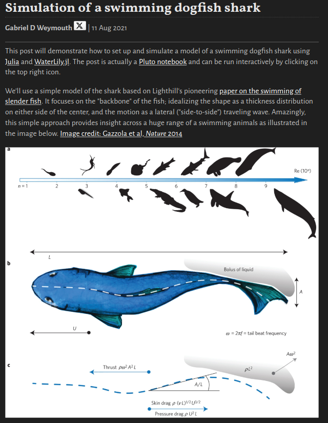
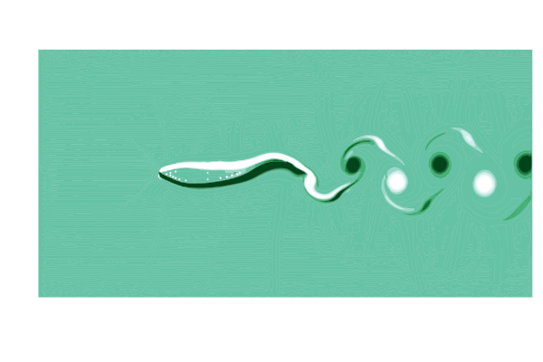
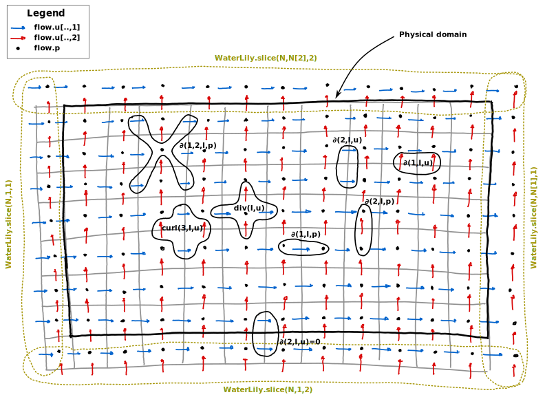

# Example simulations using [WaterLily.jl](https://github.com/WaterLily-jl/WaterLily.jl)

This repository contains example simulations using the [WaterLily.jl](https://github.com/WaterLily-jl/WaterLily.jl) package. Some tutorials are presented as [`Pluto.jl`](https://plutojl.org/) notebooks and the rest are Julia scripts. The examples are divided into 2D and 3D simulations and are listed below. The examples are intended to demonstrate the capabilities of the `WaterLily.jl` package and to provide a starting point for users to create their own simulations. 

### Youtube tutorials

An excellent initial tutorial on how to use WaterLily is available on youtube, it will help you go through the basics of the package and how to set up a simple simulation

[](https://youtu.be/OO0Nz3uWDc8?si=cdQKsh2zQTsgYj75)

<!-- [](https://www.youtube.com/watch?v=6PmJJKVOfvc&list=PLQO9vKCRROdYEI218QIUICwv8IAAbOuCq&index=1) -->

### Pluto notebooks

Two example notebooks are available to help you get started with WaterLily, they are available in the `notebooks` folder, have a look [here](https://plutojl.org/#try) if you don't know how to use Pluto.

[](notebooks/Shark.jl)


### List examples

Below we provide a list of all the examples available

#### 2D
- [2D flow around a circle](examples/TwoD_Circle.jl)
- [2D flow around a circle with periodic boundary conditions](examples/TwoD_CirclePeriodicBC.jl)
- [2D flow around a circle in 1DOF vortex-induced-vibration](examples/TwoD_CircleVIV.jl)
- [2D flow around a flapping plate](examples/TwoD_Hover.jl)
- [2D flow around the Julia logo](examples/TwoD_Julia.jl)
- [2D Lid-driven cavity flow (show how to overwrite BC! function)](examples/TwoD_LidCavity.jl)
- [2D flow around multiple cylinders using the AutoBodies](examples/TwoD_MultipleBodies.jl)
- [2D flow around a circle with oscillating body force](examples/TwoD_OscillatingFlowOverCircle.jl)
- [2D flow around circle in an accelerating frame of reference using time-dependent boundary conditions](examples/TwoD_SlowStartCircle.jl)
- [2D flow around a square using AutoBodies set operations](examples/TwoD_Square.jl)
- [2D Tandem airfoil motion optimisation using AutoDiff](examples/TwoD_TandemFoilOptim.jl)
- [2D flow around a triangle with a custom sdf](examples/TwoD_Triangle.jl)
- [2D flow around a circle fully in the terminal](examples/TwoD_UnicodePlots.jl)
- [2D channel flow with periodic BCs](examples/TwoD_Channel.jl)
#### 3D
- [3D Taylor-Green vortex break down](examples/ThreeD_TaylorGreenVortex.jl)
- [3D donut flow, using the GPU and Makie for live rendering](examples/ThreeD_Donut.jl)
- [3D jellyfish, using the GPU and Makie for live rendering](examples/ThreeD_Jelly.jl)
- [3D flow around the hover, extruded sdf and complex Write VTK](examples/ThreeD_HoverWriteVTK.jl)
- [3D cylinder flow with vtk file save ad restart](examples/ThreeD_CylinderVTKRestart.jl)

### Detailed examples

#### Flow over a circle
We define the size of the simulation domain as `n`$\times$`m` cells. The circle has radius `m/8` and is centered at `(m/2,m/2)`. The flow boundary conditions are `(U,0)`, where we set `U=1`, and the Reynolds number is `Re=U*radius/ν` where `ν` (Greek "nu" U+03BD, not Latin lowercase "v") is the kinematic viscosity of the fluid.
```julia
using WaterLily
function circle(n,m;Re=250,U=1)
    radius, center = m/8, m/2
    body = AutoBody((x,t)->√sum(abs2, x .- center) - radius)
    Simulation((n,m), (U,0), radius; ν=U*radius/Re, body)
end
```
The second to last line defines the circle geometry using a [signed distance function](https://en.wikipedia.org/wiki/Signed_distance_function#Applications). The `AutoBody` function uses [automatic differentiation](https://github.com/JuliaDiff/) to infer the other geometric parameter automatically. Replace the circle's distance function with any other, and now you have the flow around something else... such as a [donut](https://github.com/WaterLily-jl/WaterLily-Examples/blob/master/examples/ThreeD_Donut.jl) or the [Julia logo](https://github.com/WaterLily-jl/WaterLily-Examples/blob/master/examples/TwoD_Julia.jl). Finally, the last line defines the `Simulation` by passing in parameters we've defined.

Now we can create a simulation (first line) and run it forward in time (third line)
```julia
circ = circle(3*2^6,2^7)
t_end = 10
sim_step!(circ,t_end)
```
Note we've set `n,m` to be multiples of powers of 2, which is important when using the (very fast) geometric multi-grid solver. We can now access and plot whatever variables we like. For example, we could print the velocity at `I::CartesianIndex` using `println(circ.flow.u[I])` or plot the whole pressure field using
```julia
using Plots
contour(circ.flow.p')
```
A set of [flow metric functions](https://github.com/WaterLily-jl/WaterLily.jl/blob/master/src/Metrics.jl) have been implemented and the examples use these to make gifs such as the one above.

#### 3D Taylor Green Vortex
The three-dimensional [Taylor Green Vortex](https://github.com/WaterLily-jl/WaterLily-Examples/blob/master/examples/ThreeD_TaylorGreenVortex.jl) demonstrates many of the other available simulation options. First, you can simulate a non-trivial initial velocity field by passing in a vector function `uλ(i,xyz)` where `i ∈ (1,2,3)` indicates the velocity component `uᵢ` and `xyz=[x,y,z]` is the position vector.
```julia
function TGV(; pow=6, Re=1e5, T=Float64, mem=Array)
    # Define vortex size, velocity, viscosity
    L = 2^pow; U = 1; ν = U*L/Re
    # Taylor-Green-Vortex initial velocity field
    function uλ(i,xyz)
        x,y,z = @. (xyz-1.5)*π/L               # scaled coordinates
        i==1 && return -U*sin(x)*cos(y)*cos(z) # u_x
        i==2 && return  U*cos(x)*sin(y)*cos(z) # u_y
        return 0.                              # u_z
    end
    # Initialize simulation
    return Simulation((L, L, L), (0, 0, 0), L; U, uλ, ν, T, mem)
end
```
This example also demonstrates the floating point type (`T=Float64`) and array memory type (`mem=Array`) options. For example, to run on an NVIDIA GPU we only need to import the [CUDA.jl](https://github.com/JuliaGPU/CUDA.jl) library and initialize the `Simulation` memory on that device.
```julia
import CUDA
@assert CUDA.functional()
vortex = TGV(T=Float32,mem=CUDA.CuArray)
sim_step!(vortex,1)
```
For an AMD GPU, use `import AMDGPU` and `mem=AMDGPU.ROCArray`. Note that Julia 1.9 is required for AMD GPUs.

#### Moving bodies


You can simulate moving bodies in WaterLily by passing a coordinate `map` to `AutoBody` in addition to the `sdf`.
```julia
using StaticArrays
function hover(L=2^5;Re=250,U=1,amp=π/4,ϵ=0.5,thk=2ϵ+√2)
    # Line segment SDF
    function sdf(x,t)
        y = x .- SA[0,clamp(x[2],-L/2,L/2)]
        √sum(abs2,y)-thk/2
    end
    # Oscillating motion and rotation
    function map(x,t)
        α = amp*cos(t*U/L); R = SA[cos(α) sin(α); -sin(α) cos(α)]
        R * (x - SA[3L-L*sin(t*U/L),4L])
    end
    Simulation((6L,6L),(0,0),L;U,ν=U*L/Re,body=AutoBody(sdf,map),ϵ)
end
```
[In this example](https://github.com/WaterLily-jl/WaterLily-Examples/blob/master/examples/TwoD_Hover.jl), the `sdf` function defines a line segment from `-L/2 ≤ x[2] ≤ L/2` with a thickness `thk`. To make the line segment move, we define a coordinate transformation function `map(x,t)`. In this example, the coordinate `x` is shifted by `(3L,4L)` at time `t=0`, which moves the center of the segment to this point. However, the horizontal shift varies harmonically in time, sweeping the segment left and right during the simulation. The example also rotates the segment using the rotation matrix `R = [cos(α) sin(α); -sin(α) cos(α)]` where the angle `α` is also varied harmonically. The combined result is a thin flapping line, similar to a cross-section of a hovering insect wing.

One important thing to note here is the use of `StaticArrays` to define the `sdf` and `map`. This speeds up the simulation since it eliminates allocations at every grid cell and time step.

#### Circle inside an oscillating flow


This [example](https://github.com/WaterLily-jl/WaterLily-Examples/blob/master/examples/TwoD_OscillatingFlowOverCircle.jl) demonstrates a 2D oscillating periodic flow over a circle.
```julia
function circle(n,m;Re=250,U=1)
    # define a circle at the domain center
    radius = m/8
    body = AutoBody((x,t)->√sum(abs2, x .- (n/2,m/2)) - radius)

    # define time-varying body force `g` and periodic direction `perdir`
    accelScale, timeScale = U^2/2radius, radius/U
    g(i,t) = i==1 ? -2accelScale*sin(t/timeScale) : 0
    Simulation((n,m), (U,0), radius; ν=U*radius/Re, body, g, perdir=(1,))
end
```
The `g` argument accepts a function with direction (`i`) and time (`t`) arguments. This allows you to create a spatially uniform body force with variations over time. In this example, the function adds a sinusoidal force in the "x" direction `i=1`, and nothing to the other directions.

The `perdir` argument is a tuple that specifies the directions to which periodic boundary conditions should be applied. Any number of directions may be defined as periodic, but in this example only the `i=1` direction is used allowing the flow to accelerate freely in this direction.

#### Accelerating reference frame

WaterLily gives the possibility to set up a `Simulation` using time-varying boundary conditions for the velocity field, as demonstrated in [this example](https://github.com/WaterLily-jl/WaterLily-Examples/blob/master/examples/TwoD_SlowStartCircle.jl). This can be used to simulate a flow in an accelerating reference frame. The following example demonstrates how to set up a `Simulation` with a time-varying velocity field.
```julia
using WaterLily
# define time-varying velocity boundary conditions
Ut(i,t::T;a0=0.5) where T = i==1 ? convert(T, a0*t) : zero(T)
# pass that to the function that creates the simulation
sim = Simulation((256,256), Ut, 32)
```
The `Ut` function is used to define the time-varying velocity field. In this example, the velocity in the "x" direction is set to `a0*t` where `a0` is the acceleration of the reference frame. The `Simulation` function is then called with the `Ut` function as the second argument. The simulation will then run with the time-varying velocity field.


#### Periodic and convective boundary conditions

In addition to the standard free-slip (or reflective) boundary conditions, WaterLily also supports periodic boundary conditions, as demonstrated in [this example](https://github.com/WaterLily-jl/WaterLily-Examples/blob/master/examples/TwoD_circle_periodicBC_convectiveBC.jl). For instance, to set up a `Simulation` with periodic boundary conditions in the "y" direction the `perdir=(2,)` keyword argument should be passed
```julia
using WaterLily,StaticArrays

# sdf an map for a moving circle in y-direction
function sdf(x,t)
    norm2(SA[x[1]-192,mod(x[2]-384,384)-192])-32
end
function map(x,t)
    x.-SA[0.,t/2]
end

# make a body
body = AutoBody(sdf, map)

# y-periodic boundary conditions
Simulation((512,384), (1,0), 32; body, perdir=(2,))
```

Additionally, the flag `exitBC=true` can be passed to the `Simulation` function to enable convective boundary conditions. This will apply a 1D convective exit in the __`x`__ direction (currently, only the `x` direction is supported for the convective outlet BC). The `exitBC` flag is set to `false` by default. In this case, the boundary condition is set to the corresponding value of the `u_BC` vector specified when constructing the `Simulation`.

```julia
using WaterLily

# make a body
body = AutoBody(sdf, map)

# y-periodic boundary conditions
Simulation((512,384), u_BC=(1,0), L=32; body, exitBC=true)
```

#### Writing to a VTK file

The following [example](https://github.com/WaterLily-jl/WaterLily-Examples/blob/master/examples/ThreeD_CylinderVTKRestart.jl) demonstrates how to write simulation data to a `.pvd` file using the `WriteVTK` package and the WaterLily `vtkwriter` function. The simplest writer can be instantiated with

```julia
using WaterLily,WriteVTK

# make a sim
sim = make_sim(...)

# make a writer
writer = vtkWriter("simple_writer")

# write the data
write!(writer,sim)

# don't forget to close the file
close(writer)
```
This would write the velocity and pressure fields to a file named `simple_writer.pvd`. The `vtkWriter` function can also take a dictionary of custom attributes to write to the file. For example, the following code can be run to write the body signed-distance function and λ₂ fields to the file
```julia
using WaterLily,WriteVTK

# make a writer with some attributes, need to output to CPU array to save file (|> Array)
vtk_velocity(a::Simulation) = a.flow.u |> Array;
vtk_pressure(a::Simulation) = a.flow.p |> Array;
vtk_body(a::Simulation) = (measure_sdf!(a.flow.σ, a.body, WaterLily.time(a));
                                        a.flow.σ |> Array;)
vtk_lamda(a::Simulation) = (@inside a.flow.σ[I] = WaterLily.λ₂(I, a.flow.u);
                            a.flow.σ |> Array;)

# map field names to values in the file
custom_attrib = Dict(
    "Velocity" => vtk_velocity,
    "Pressure" => vtk_pressure,
    "Body" => vtk__body,
    "Lambda" => vtk_lamda
)

# make the writer
writer = vtkWriter("advanced_writer"; attrib=custom_attrib)
...
close(writer)
```
The functions that are passed to the `attrib` (custom attributes) must follow the same structure as what is shown in this example, that is, given a `Simulation`, return an N-dimensional (scalar or vector) field. The `vtkwriter` function will automatically write the data to a `.pvd` file, which can be read by ParaView. The prototype for the `vtkwriter` function is:
```julia
# prototype vtk writer function
custom_vtk_function(a::Simulation) = ... |> Array
```
where `...` should be replaced with the code that generates the field you want to write to the file. The piping to a (CPU) `|> Array` is necessary to ensure that the data is written to the CPU before being written to the file for GPU simulations.

> **_NOTE:_** 
The `WriteVTK.jl` package requires components to come first when writing vector and tensor fields, but they are store with component last in `WaterLily`. For vector field, this permutation of dimensions is done automatically in the `write!` function ($V_{ijkα}→ V_{αijk}$). This is why you can simply pass `sim.flow.u |> Array` to the writer.
For tensor fields, you will need to permute the dimensions __once__ yourself ($T_{ijkαβ}→ T_{βijkα}$) before writing to the file, the second permutation is done in the `write!` function ($T_{βijkα}→ T_{αβijk}$). This operation can be done simply as `permutedims(TensorField, (4,1,2,3))`.

#### Restarting from a VTK file

The restart of a simulation from a VTK file is demonstrated in [this example](https://github.com/WaterLily-jl/WaterLily-Examples/blob/master/examples/ThreeD_CylinderVTKRestart.jl). The `ReadVTK` package is used to read simulation data from a `.pvd` file. This `.pvd` __must__ have been written with the `vtkwriter` function and __must__ contain at least the `velocity` and `pressure` fields. The following example demonstrates how to restart a simulation from a `.pvd` file using the `ReadVTK` package and the WaterLily `vtkreader` function
```julia
using WaterLily,ReadVTK
sim = make_sim(...)
# restart the simulation
writer = restart_sim!(sim; fname="file_restart.pvd")

# append sim data to the file used for restart
write!(writer, sim)

# don't forget to close the file
close(writer)
```
Internally, this function reads the last file in the `.pvd` file and use that to set the `velocity` and `pressure` fields in the simulation. The `sim_time` is also set to the last value saved in the `.pvd` file. The function also returns a `vtkwriter` that will append the new data to the file used to restart the simulation. __Note__ that the simulation object `sim` that will be filled must be identical to the one saved to the file for this restart to work, that is, the same size, same body, etc.

#### Overwriting default functions

Sometime, it might be usefull to overwrite the default functions used in the simulation. For example, the `BC!` function can be overwritten to implement a custom boundary condition, see [this example](examples/TwoD_LidCavity.jl). For example to overwrite the `mom_step!` function you will need something like this
```julia
function WaterLily.mom_step!(a::Flow{N},b::AbstractPoisson) where N
    ...do your thing...
end
```
in your main script. This means that internally, when EaterLily call `mom_step!` it will call this ew function and not the one in `src/Flow.jl`. This can be used to implement custom boundary conditions, custom body forces, etc.

> **_NOTE:_**  In WaterLily we use a [staggered grid](https://tum-pbs.github.io/PhiFlow/Staggered_Grids.html), this means that the velocity component and the pressure are not at the same physical location in the finite-volume mesh, see figure below. You have to be careful if you play with the `BC!` function to make sure that you are applying the boundary condition to the correct physical location.



### Citing

If you have used `WaterLily.jl` for research, please __cite us__! The following manuscript describes the main features of the solver and provides benchmarking, validation, and profiling results.
```
@misc{WeymouthFont2024,
    title         = {WaterLily.jl: A differentiable and backend-agnostic Julia solver to simulate incompressible viscous flow and dynamic bodies},
    author        = {Gabriel D. Weymouth and Bernat Font},
    url           = {https://arxiv.org/abs/2407.16032},
    eprint        = {2407.16032},
    archivePrefix = {arXiv},
    year          = {2024},
    primaryClass  = {physics.flu-dyn}
}
```

### Contributing

We are always looking for new examples to showcase the capabilities of `WaterLily.jl`. If you came up with amazing examples and you want to share them, please open a pull request with the new exmaple either as a `Pluto.jl` notebook or a classic script. We will be happy to review it and merge it into the repository.
